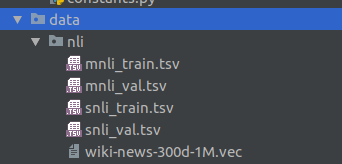

## Homework 2

The data items are not commited to GitHub, in order to run the code, please have the following structure for data:

For more a more detail guide on how to run the code, please refer to the notebook: 
**use_guide.ipynb**

The main scripts/notebooks used are in the root directory:
- grid_search_rnn.py: searches various hyperparameter combinations for rnn
    - results are in model_saves/rnn_results.csv
- grid_search_cnn.py: searches various hyperparameter combinations for cnn
    - results are in model_saves/cnn_results.csv
- tune_mnli.py: tuning all of the mnli models
    - results are in model_saves/mnli_tuning.csv
- Other notebooks are mostly used for prototyping purposes.

 

